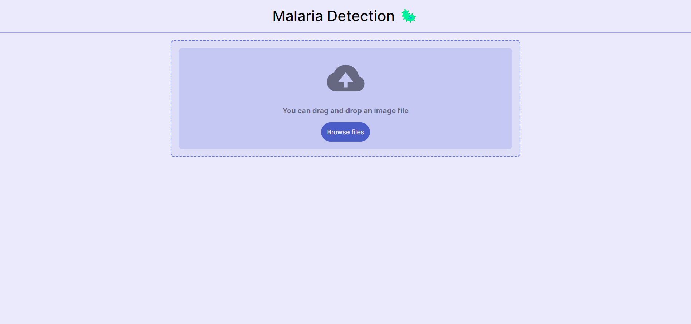
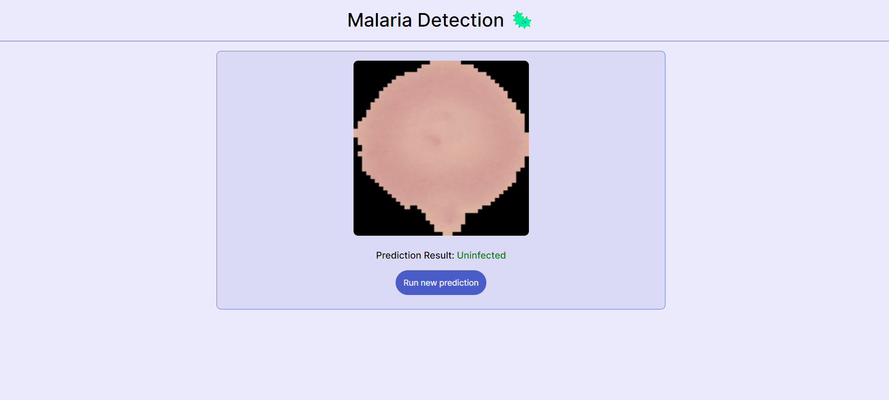

# Malaria Cell Detection App

This is a live deployment of a machine learning model that i developed during my CS degree as a part of machine learning course. The link to the original model training code is [here](https://github.com/Anindra123/Ensemble-Malaria-Detection). The models were trained with ensemble learning and had a AUC score of 0.97. The app takes a cell image and predicts whether it parasitized or uninfected cell based on the parasitic lesion observed on the cell.The model was trained using reduced feature set by utilizing PCA. The full technical paper of the model training is given [here](https://drive.google.com/file/d/19owUJdk34yYclXhCIQXM0Zq7Eew1FViJ/view?usp=sharing).


## Screenshots




## Run Locally

### Using Docker

This project has been dockerized to make sure there is not conflict between python packages and version. To run locally with docker make sure you have docker desktop installed first. Then run the following commands : 

- Clone the repository
```bash
git clone https://github.com/Anindra123/malaria-detection-app.git

cd malaria-detection-app
```

- Build the docker image
```
docker build . -t <your_tag_name>
```

After successful build open your docker desktop app  and you will see a image with tag name you have given for <your_tag_name>. Then click on the run button of the created image to spin up a container, on the settings give a `port number`. Then the app will start running on `localhost:your_port_number`.

## Dependencies 

- Python 3.9.8
- Docker
- Flask 3.0.2
- Pillow 10.3.0
- numpy 1.26.4
- scikit-learn 1.0.2
- scikit-image 0.22.0